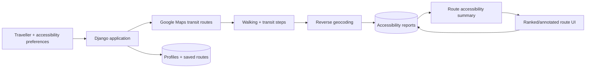

# TransitAssist

TransitAssist is a **solo full-stack Django project** for planning public-transport journeys with accessibility information layered onto the route itself. I designed and implemented the backend, data model, authentication flows, community reporting, routing UI, map integrations, and deployment configuration.

The core idea is that a route is not useful merely because it is geographically valid: for a traveller with accessibility requirements, individual streets, stations, transfers, vehicles, lifts, ramps, signage, or service-animal policies can determine whether the journey is realistically usable.

> **Project status:** completed product prototype. It demonstrates the end-to-end system and accessibility-aware ranking idea, but community reports are unverified user submissions and the accessibility score is a hand-designed heuristic rather than a validated routing metric.

## What is implemented

- account creation, login, profile completion, and optional GitHub social auth;
- user accessibility preferences such as wheelchair access, low-floor vehicles, service-animal support, braille/large-print signage, and lifts/escalators;
- Google Maps transit route generation and place autocomplete;
- reverse-geocoding of walking segments so accessibility reports can be attached to route locations;
- community reports for accessibility problems and positive accessibility features;
- per-route aggregation of those reports;
- optional accessibility-aware route ordering;
- saved-route history and autosave preferences;
- Django admin/data persistence and a Render-oriented deployment path.

## Reviewer guide

If you are reviewing this as a coding sample, start with:

| Area | What it shows |
| --- | --- |
| [`main/models.py`](main/models.py) | custom user model, preferences, map settings, saved routes, and accessibility-report schema |
| [`main/views.py`](main/views.py) | account/profile flows and the API endpoints used by the interactive map |
| [`main/templates/navigate.html`](main/templates/navigate.html) | route generation, accessibility enrichment, ranking and reporting UI |
| [`main/pipeline.py`](main/pipeline.py) | social-auth profile pipeline |
| [`back/settings.py`](back/settings.py) | Django/social-auth/static configuration with environment-based secrets |
| [`main/migrations/`](main/migrations/) | persisted application model history |

The most interesting engineering idea is the **route enrichment loop**: a normal transit route is decomposed into walking and transit steps, those steps are mapped to reportable locations, community accessibility signals are aggregated, and the resulting evidence is surfaced back into route selection rather than existing as a separate review page.

## Architecture



### Accessibility data model

TransitAssist stores both negative and positive community observations. A route step can therefore show, for example, repeated reports of a missing ramp while also showing positive reports for low-floor buses or accessible signage. User preferences filter which positive accessibility features are especially relevant to that traveller.

This is intentionally a prototype of the product mechanism, not a claim that crowd reports alone are sufficient for reliable accessible navigation.

## Local setup

```bash
python -m venv .venv
# Windows: .venv\Scripts\activate
# Unix/macOS: source .venv/bin/activate
python -m pip install --upgrade pip
pip install -r requirements.txt
cp .env.example .env
python manage.py migrate
python manage.py createsuperuser   # optional
python manage.py runserver
```

The application uses Django's built-in authentication model plus `social-auth-app-django` for the optional GitHub login path. It does **not** use JWT authentication for its normal browser sessions.

## Configuration

Secrets are not intended to be committed. Configure them through the environment:

```text
DJANGO_SECRET_KEY=
DJANGO_DEBUG=1
DJANGO_ALLOWED_HOSTS=localhost,127.0.0.1

SOCIAL_AUTH_GITHUB_KEY=
SOCIAL_AUTH_GITHUB_SECRET=

GOOGLE_MAPS_API_KEY=
GEOAPIFY_API_KEY=
```

The two map-provider keys are used in browser-side requests, so they are not confidential once delivered to a browser. They should nevertheless be supplied through deployment configuration rather than checked into source, and restricted at the provider to the required APIs and allowed origins.

## Repository structure

```text
back/                   Django project settings / URLs / WSGI
main/
  migrations/           data-model history
  static/               product assets
  templates/            pages and interactive routing UI
  models.py             domain/data model
  views.py              browser + JSON endpoints
  pipeline.py           social-auth profile setup
  context_processors.py browser API configuration
manage.py
requirements.txt
```

## Security and privacy notes

The project stores profile/contact details and accessibility preferences, which can be sensitive personal information. A production deployment would need a substantially stronger privacy model than the prototype: explicit data minimisation, retention/deletion controls, permissions around report/profile access, abuse prevention, and a clear policy for how community accessibility reports are moderated.

Previously committed development credentials have been removed from the maintained source. Any provider credential that has ever appeared in Git history should still be considered exposed and rotated/restricted at the provider level.

## Current limitations

- Accessibility reports are crowdsourced and are not independently verified.
- The current route ordering uses a simple report-count heuristic rather than a calibrated model of route usability.
- Different disabilities and traveller preferences cannot be reduced safely to one universal accessibility score.
- The large route page grew rapidly during the prototype and contains too much inline JavaScript; splitting it into a typed/tested client module would be an important refactor.
- Several JSON endpoints use broad exception handling and index-based ORM access that should be replaced with explicit validation and error responses.
- There is not yet a meaningful automated test suite covering route/report invariants.

## What I would improve next

The first engineering pass would separate route enrichment/ranking from the template into a dedicated client/service layer and move the scoring rule into a small independently testable module. I would then add endpoint authorization/validation tests, moderation/provenance for community reports, expiry or freshness weighting for accessibility observations, and a multi-objective route model that exposes the trade-off to the user rather than collapsing every accessibility need into one scalar score.

## Ownership

TransitAssist was designed and built by **Yuvan Chikka as a solo project**.
